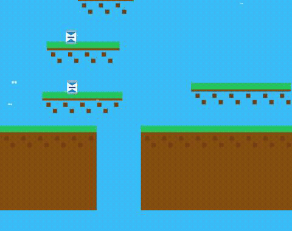

# Котик и Сгущенка (Cat and Condensed Milk)

<p align="center">
  <a href="https://github.com/thatguynikita/condensed-milk-quest/actions/workflows/ci.yml"></a>
  <a href="LICENSE"></a>
  <a href="https://cat.nikita.sh"></a>
</p>

<p align="center">
  
</p>

<p align="center"><b><a href="https://cat.nikita.sh">▶ Play it live at cat.nikita.sh</a></b></p>

A small browser platformer: collect 30 cans of condensed milk, dodge dogs and
cacti, reach the flag. Playable standalone, and embedded as an iframe "app"
inside [nikita.sh](https://github.com/thatguynikita/nikita.sh)'s
terminal-themed portfolio.

Built with vanilla JS and the Canvas 2D API — no game engine — bundled with
[Vite](https://vitejs.dev). Bilingual (RU/EN), with a pause menu, a touch
control scheme for mobile, and a weekly Firebase-backed leaderboard.

## Stack

- Vanilla JS (ES modules), Canvas 2D for rendering
- [Vite](https://vitejs.dev) for dev server + build
- [Tailwind CSS v4](https://tailwindcss.com) for UI chrome (menus, HUD, buttons)
- [Tone.js](https://tonejs.github.io) for the procedurally-triggered chiptune audio
- [Firebase](https://firebase.google.com) (Firestore + anonymous Auth) for the leaderboard
- [Vitest](https://vitest.dev) for unit tests, ESLint + Prettier for linting/formatting

## Architecture

```
index.html            DOM skeleton only — canvas, menus, touch controls
src/
  main.js              Composition root: owns the game loop, input listeners,
                        instantiates player/level/butterflies
  state.js              Shared runtime state (game phase, camera, keys, timers)
  config.js              Tunable gameplay constants (physics, level generation, timers)
  styles/main.css         Tailwind + the handful of custom CSS rules (pixel-text outline,
                           touch-control styling, pointer:coarse media query)
  entities/                One file per game object: Player, DogEnemy, CactusEnemy,
                            CondensedMilk, BouncingMilk, Butterfly
  level/
    Level.js               Procedural level generation + world rendering
    collision.js            Shared AABB overlap check, used by every collision test
  render/draw.js             Per-frame draw orchestration (sky, clouds, world, entities)
  ui/
    hud.js                   Score/timer HUD rendering
    menus.js                 Start/pause/win overlays, language & sound toggles,
                              startGame/gameWin/pause-resume
    touchControls.js          Mobile on-screen button bindings
  i18n/translations.js        RU/EN copy + t()/getLang()/setLang()
  audio/synths.js              Tone.js synth setup and all sound-effect triggers
  net/leaderboard.js            Firebase init, score read/write, leaderboard rendering
tests/                          Vitest unit tests (collision, level generation, i18n parity)
```

Gameplay tuning knobs live in `config.js`; purely cosmetic pixel-art numbers
(sprite coordinates inside each entity's `draw()`) stay inline, since those
are art, not balance.

## Local development

```bash
npm install
cp .env.example .env   # fill in Firebase config (see below)
npm run dev
```

### Firebase config

The leaderboard needs a Firebase project (Firestore + Anonymous Auth
enabled). These are Web SDK config values, not secrets — access is
controlled by Firestore security rules — but they're read from environment
variables rather than hardcoded, so `.env` isn't committed. Copy
`.env.example` to `.env` and fill in your project's values. Without a valid
`.env`, the game still runs fine; the leaderboard just silently no-ops
(`initLeaderboard()` catches init failures).

## Scripts

| Command | What it does |
|---|---|
| `npm run dev` | Start the Vite dev server |
| `npm run build` | Production build to `dist/` |
| `npm run preview` | Serve the `dist/` build locally |
| `npm run lint` | ESLint |
| `npm run format` | Prettier, writes in place |
| `npm run test` | Vitest |

## Deploy

Not wired up yet. `npm run build` produces a static `dist/` — publishing it
is currently a manual step. The plan is to eventually match whatever deploy
approach nikita.sh settles on for itself; that isn't finalized there yet, so
this repo isn't guessing at one in the meantime.

## License

[MIT](LICENSE).
